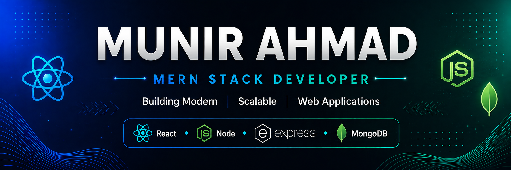

<!-- ========================= Banner ========================= -->

<p align="center">
  
</p>

<!-- ===================== Animated Typing ==================== -->

<a href="https://git.io/typing-svg"></a>

<!-- ======================= Social Links ===================== -->

<p align="center">

<a href="https://www.linkedin.com/in/buildwithmunir">

</a>

<a href="https://github.com/buildwithmunir">

</a>

<a href="mailto:munirdev76@gmail.com">

</a>

<a href="https://learnhubreact.netlify.app">

</a>

</p>

<!-- ===================== Profile Views ====================== -->

<p align="center">

</p>

<br>

## 💫 About Me

<table>
<tr>

<td width="58%">

```bash
👨‍💻 Name          : Munir Ahmad

💼 Role          : MERN Stack Developer

📍 Location      : Lahore, Pakistan 🇵🇰

🚀 Currently     : Building scalable Full Stack Web Applications

⚛️ Tech Stack    : React.js
                   Node.js
                   Express.js
                   MongoDB

🛠 Tools         : Git
                   GitHub
                   VS Code
                   Postman

🎯 Interests     : Open Source
                   REST APIs
                   Software Architecture
                   UI / UX

🤝 Available For : Freelance
                   Collaboration
                   Open Source

☕ Motto         : "Build • Learn • Improve • Repeat 🚀"
```

</td>

<td width="42%" align="center">


</td>

</tr>
</table>

### 🌟 What Drives Me

- 🚀 Passionate about building modern, scalable, and production-ready web applications.
- 💡 I enjoy transforming ideas into real-world digital products.
- ⚡ Writing clean, maintainable, and efficient code.
- 🌍 Continuously exploring new technologies and software architecture.
- 🤝 Open to freelance opportunities, collaborations, and open-source contributions.